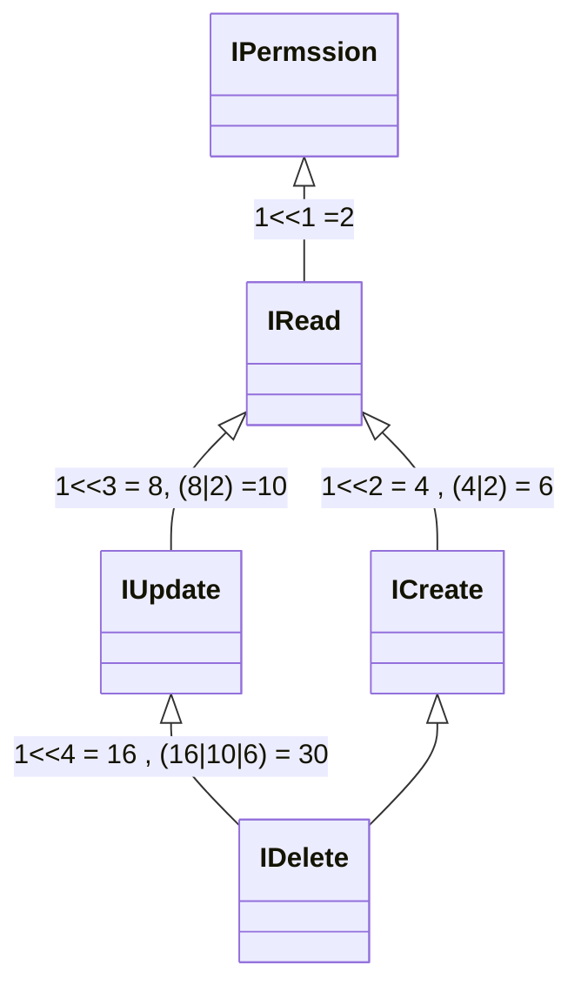

## 권한 관리 샘플

1. 무한의 기능관리 가능
2. 권한의 상속관리 가능

## 기본 메커니즘
큰숫자의 비트연산을 통해서 권한을 관리 할 수 있다.
사용자에게 부여된 숫자와 사용하고 싶은 기능에 부여된 숫자를 & 연산하여 0이 아니면 해당 기능의 권한을 갖는 것으로 판별한다.

ICreate에는 4, IRead에는 2, IDelete는 16의 값이 부가 되었다. 이는 각각 1에 left shift 연산의 결과 이다.
 

| 600    | ... | ... | ... | QQQ | XXX | YYY | IDelete | IUpdate   | ICreate   | IRead   | 0   |
|--------|-----|-----|-----|-----|-----|-----|-----|-----|-----|-----|-----|
| 600    | ... | ... | ... | 7   | 6   | 5   | 4   | 3   | 2   | 1   | 0   |
| 1<<600 | ... | ... | ... | 128 | 64  | 32  | 16  | 8   | 4   | 2   | 1   |

User의 권한이 값이 8이라면 수정 권한을 갖는다. 수정권한과 읽기 권한을 모두 갖기 위해서는 10이 필요하지만
수정권한은 읽기 권한을 상속함으로 비록 갖는 값이 8이지만 실제로 10을 갖는 것과 같은 효과를 갖는다.
