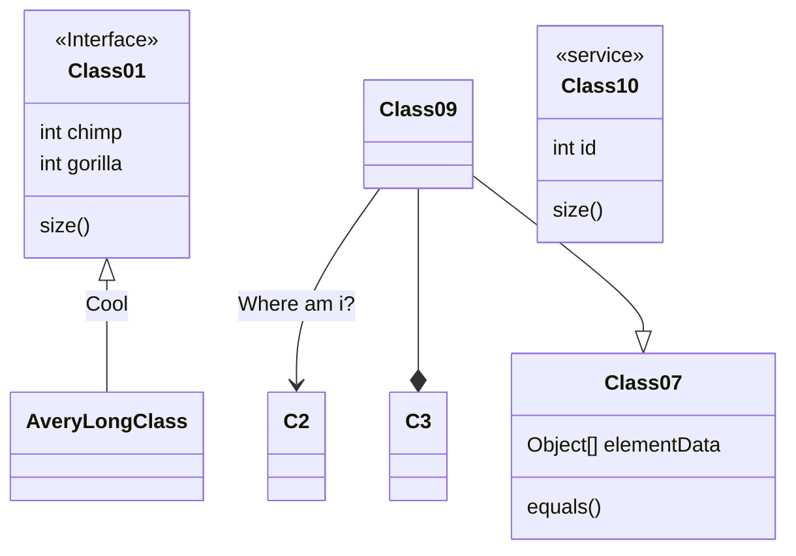

## 권한 관리 샘플

1. 무한의 기능관리 가능
2. 권한의 상속관리 가능

## 기본 메커니즘
호출 가능한 메소드에 어트리뷰트를 설정한다.
이 어트리뷰트에는 이 메소드를 호출 할 수 있는 숫자값 집합을 갖는다.
이 숫자값 집합은 1<<x, 1<<y의 의미 이다. 
로그인한 사용자 또는 큰 숫자 값을 갖는다. 사용자와 어트리뷰트의 숫자의 &가 0이 아니라면 이 메소드를
호출 할 수 있다.

예) A의 메소드에 세팅된 숫자 값이 8(1<<3) 이고 사용자의 숫자값이 10(1<<3 | 1<<1) 이라면 이 사용자는 A메소드를 
호출 할 수 있다.
그런데 A의 메소드는 읽기이고 B 메소드는 쓰기일때 사용자가 읽기권한은 없으나 쓰기 권한이 있다면 논리적으로 이해
하기 힘들다. 따라서 이문제를 해결 해야 하는데 c# interface를 사용해서 상속 관계를 맺은 후
자식 인터페이스에 세팅된 숫자의 left shift값을 자동으로 갖는다고 생각하고 세팅하면 된다.

 

| 600    | ... | ... | ... | 7   | 6   | 5   | 4   | 3   | 2   | 1   | 0   |
|--------|-----|-----|-----|-----|-----|-----|-----|-----|-----|-----|-----|
 | 1<<600 | ... | ... | ... | 128 | 64  | 32  | 16  | 8   | 4   | 2   | 1   |

